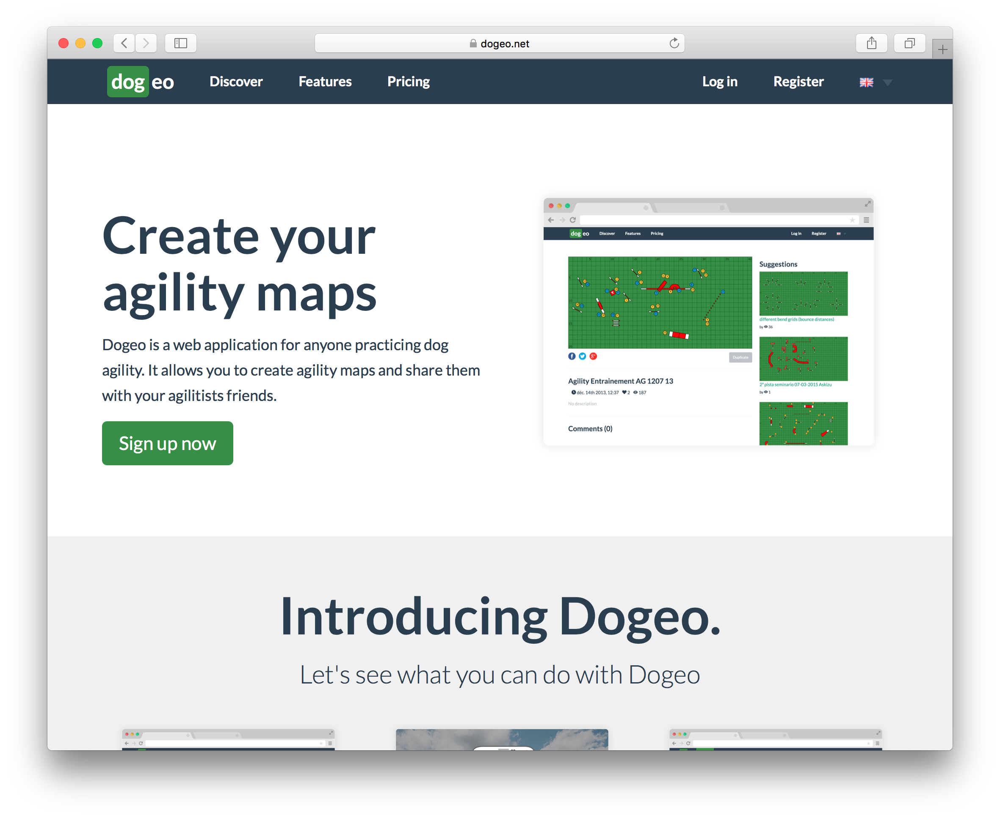
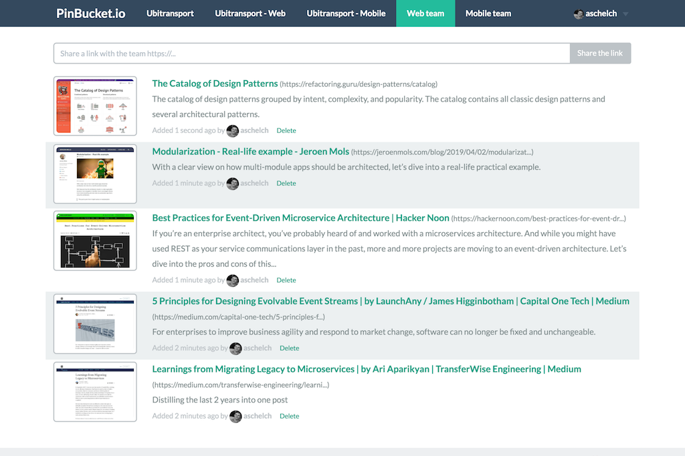

### Hi there, I'm Aurélien - aka aschelch 👋

### Connect with me:

 

### My personal projects:

 
 
 
 
 
 
 
 
 
 
 
 
 
 

- [Dogeo.net](https://dogeo.net) - A web app to create and share [agility](https://en.wikipedia.org/wiki/Dog_agility) map
- [WiTrip.fr](http://witrip.fr) - A mobile app to ease traveling using multiple car by sharing each other location on GPS
- [PinBucket.io](https://www.pinbucket.io) - A web app to save and share links between team members
- [MunchkinWeb](https://munchkin-web.herokuapp.com/) - An unofficial online game based on Munchkin card game created by Steve Jackson to play with your friends during the confinment.
- [Freebox remote](https://github.com/aschelch/freebox-remote) - A Freebox remote app

